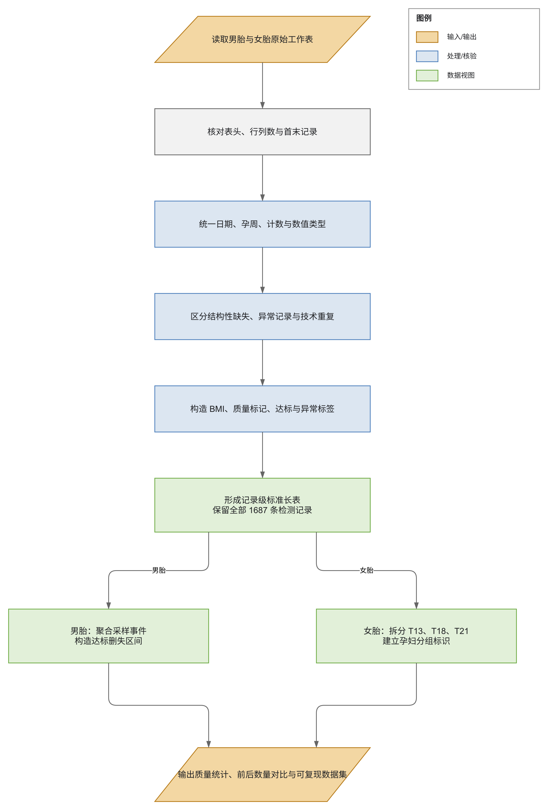
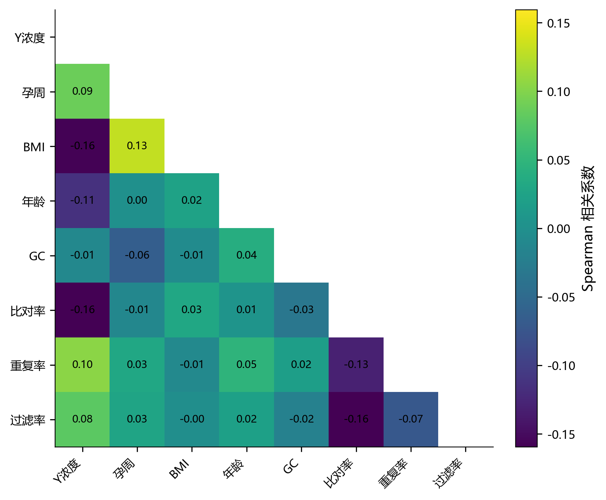
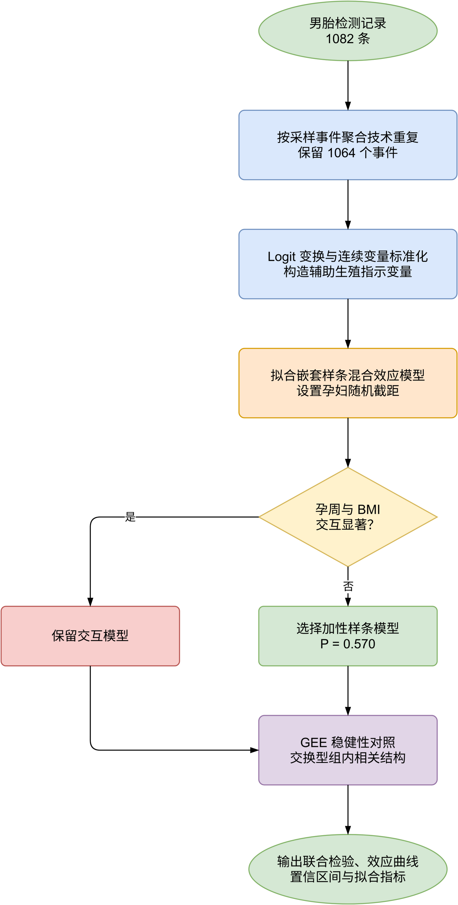
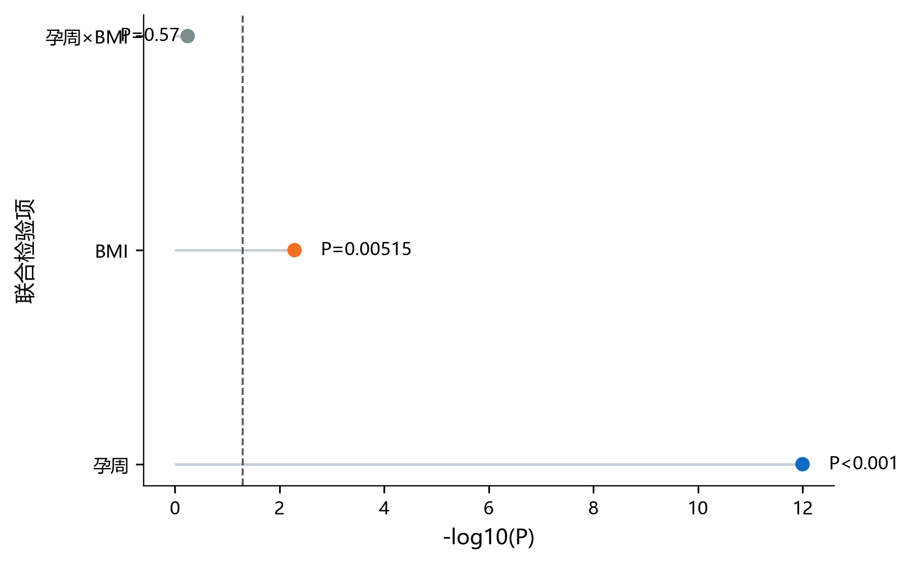
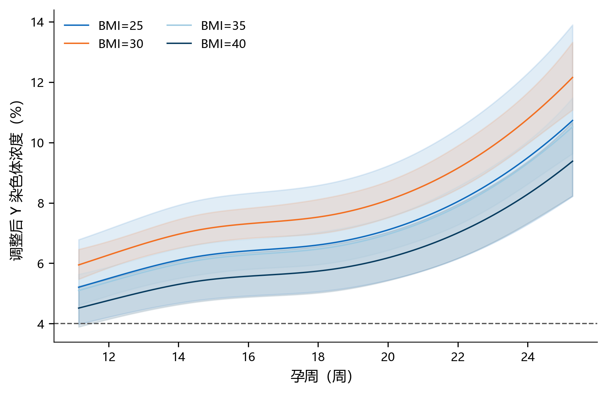

# 1 问题重述

## 1.1 问题背景

无创产前检测（NIPT）通过分析母体血液中的胎儿游离 DNA，对胎儿染色体异常进行早期筛查。检测结果的可靠性与胎儿性染色体浓度密切相关：对于男胎，Y 染色体浓度达到或超过 4% 时，检测结果通常可认为基本可靠。检测过早可能因胎儿游离 DNA 浓度不足而导致结果不准确或测序失败，检测过晚则会压缩后续诊断和治疗的时间窗口。因此，需要结合孕妇的孕周、身体质量指数（BMI）及其他个体特征，合理确定 NIPT 检测时点，并利用各项测序指标判定胎儿是否存在染色体异常。

## 1.2 问题提出

本文需要解决以下问题：

**问题一：** 根据男胎检测数据，分析胎儿 Y 染色体浓度与检测孕周、孕妇 BMI 及其他相关指标之间的相关特性，建立能够描述各因素与 Y 染色体浓度关系的模型，并检验模型及主要影响因素的显著性。

**问题二：** 将男胎 Y 染色体浓度首次达到或超过 4% 的孕周视为达标时间，以 BMI 为主要影响因素对男胎孕妇进行合理分组，同时确定各组的 BMI 区间和最佳 NIPT 时点，使浓度未达标与延迟检测造成的综合潜在风险最小，并分析检测误差对分组结果和时点选择的影响。

**问题三：** 综合孕妇年龄、身高、体重等个体因素、检测误差以及不同孕周下的 Y 染色体浓度达标比例，建立男胎 Y 染色体浓度达标模型。在此基础上，以 BMI 为最终分组依据，重新联合优化 BMI 分组数量、分组界限和各组最佳 NIPT 时点，使孕妇总体潜在风险最小，并分析检测误差对优化结果的影响。

**问题四：** 针对女胎检测数据，以 13、18、21 号染色体非整倍体检测结果为判定目标，综合相应染色体及 X 染色体的 Z 值、GC 含量、读段数及其相关比例、孕妇 BMI 等信息，建立女胎染色体异常判定方法，并评价其判定效果。

# 2 数据预处理

## 2.1 数据来源与字段结构

附件包含男胎检测数据和女胎检测数据两个工作表，分别记录 1082 次和 605 次检测，共涉及 267 名男胎孕妇和 147 名女胎孕妇。每个工作表均包含 31 个字段，主要包括样本标识与检测时间、孕妇个体特征、测序质量指标、染色体统计指标以及胎儿异常和健康结果。检测日期覆盖 2023 年 1 月 1 日至 2024 年 7 月 8 日，记录孕周范围为 11～29 周。由于同一孕妇可能接受多次采血或重复检测，原始数据属于非平衡纵向数据，不能将不同检测记录视为相互独立的个体。

## 2.2 类型统一与缺失值处理

首先核对两个工作表的表头、行列数和首末记录，然后按字段位置统一列名。原始日期同时存在八位整数、日期对象和字符串三种形式，故统一转换为日期类型；`11w+6` 等孕周字段则转换为孕周整数、附加天数、总孕天数和十进制孕周。转换后 1687 条记录的检测日期和孕周均可正常解析。

对缺失值按照业务含义分类处理。女胎不携带 Y 染色体，其 Y 染色体 Z 值和浓度共 1210 个空值属于结构性缺失，不进行插补。末次月经日期共有 20 条缺失，仅影响日期一致性核验，原记录予以保留。女胎数据中有 1 条 BMI 缺失，利用同期身高和体重按定义重新计算；其余 1686 条报告 BMI 与重算结果的绝对差均不超过 0.05。X 染色体浓度可能为负值，依据题目说明将其视为有效估计值，不作异常删除。

## 2.3 异常记录与重复检测处理

为避免高 BMI 样本或临界检测结果被机械剔除，本文将可疑记录转化为质量标记并保留原值。比例字段均处于 0～1 的合理区间；671 条记录的总体 GC 含量位于题目给出的 40%～60% 正常范围之外，71 条记录的唯一比对读段数大于原始读段数，24 条记录超出通常的 10～25 周检测窗口，另有 262 条记录的“检测日期减末次月经日期”与报告孕周相差超过 7 天。这些记录均不直接删除，而是在后续建模中通过质量协变量、稳健估计和敏感性分析考察其影响。

以胎儿性别、孕妇代码、抽血次数、检测日期和孕周共同定义一次采样事件。数据中不存在除样本序号外完全相同的重复记录，但有 66 条记录构成 33 个技术重复事件。对男胎技术重复取 Y 染色体浓度中位数作为事件级代表值，同时保留均值、标准差及极值；其中 4 个事件的重复检测结果分处 4% 阈值两侧，故额外设置不一致标记，供检测误差分析使用。

表 1 数据预处理前后数量对比

| 数据层级         | 处理前 | 处理后 | 处理说明                     |
| ---------------- | -----: | -----: | ---------------------------- |
| 男胎检测记录     |   1082 |   1082 | 全部保留并增加质量标记       |
| 女胎检测记录     |    605 |    605 | 全部保留并增加质量标记       |
| 全部检测记录     |   1687 |   1687 | 未进行自动删行               |
| 男胎采样事件     |   1082 |   1064 | 将技术重复关联为同一采样事件 |
| 男胎孕妇事件序列 |    267 |    267 | 按孕妇形成纵向事件记录       |

表 1 表明，预处理没有通过删行改变总体样本构成，仅对技术重复建立事件层关联。因此，记录级信息仍可用于浓度关系和测量误差分析，事件级数据则避免同一次采样被重复计权。

## 2.4 特征与目标构造

在记录级数据中构造十进制孕周、重算 BMI、BMI 差异、日期一致性、测序质量和技术重复等字段。对于男胎，将 Y 染色体浓度达到或超过 4% 编码为达标。对于女胎，将 AB 列空白编码为未检出异常，并把非空结果拆分为 T13、T18 和 T21 三个二元标签。女胎 605 条记录中共有 67 条至少检出一种非整倍体，其中 T13、T18 和 T21 标签分别出现 23、46 和 13 次；由于同一记录可能同时包含多个异常，三类计数之和大于异常记录总数。

男胎达标时间不能由离散检测直接确定，因此根据每名孕妇的事件序列构造删失区间。267 名孕妇中，217 名在首次检测时已经达标，记为左删失；43 名先未达标后达标，记为区间删失；7 名至最后一次检测仍未达标，记为右删失。此外，有 35 名孕妇在首次达标后又出现未达标结果，说明浓度序列存在测量波动，后续不能简单施加严格单调假设。

数据处理过程如图 1 所示。

图 1 数据预处理流程

该流程以完整保留原始信息为原则，先完成结构核验和类型转换，再通过质量标记区分异常、缺失和技术重复，最终形成记录级标准长表、男胎删失事件表和女胎多标签数据。双层结构既能支持问题一和问题四的记录级分析，也能为问题二、三重新推导 BMI 分组界限提供孕妇级事件输入。

## 2.5 数据使用与防泄漏约束

后续问题一使用男胎记录级数据分析 Y 染色体浓度，但需通过孕妇层随机效应或聚类稳健标准误处理重复观测。问题二、三使用男胎孕妇级删失事件数据，不把首次观测达标孕周误作精确生理达标时点。问题四使用女胎多标签数据，并按孕妇代码划分训练集和测试集，保证同一孕妇的多次检测不会跨集合。缺失值填补、标准化和特征筛选均在数据划分后仅利用训练集拟合。AB 列只作为预测目标，不进入特征；AE 列在女胎数据中全部为“健康”，缺少类别变化，因而不能单独用于评价异常判定模型。

# 3 问题一：Y 染色体浓度的影响因素分析

## 3.1 问题的分析

问题一要求刻画男胎 Y 染色体浓度与孕周、BMI 及其他指标之间的关系，并判断这些关系是否显著。预处理后的 1082 条男胎记录包含 1064 个采样事件，来自 267 名孕妇；同一孕妇最多存在多次随访，同一采样事件还可能包含技术重复。因此，本问的预测对象是采样事件的 Y 染色体浓度，核心解释变量是检测孕周和 BMI，年龄、受孕方式及测序质量指标作为校正变量，孕妇代码用于描述组内相关性。

若直接计算相关系数或建立普通回归，会同时忽略非线性关系和孕妇内重复观测。图 2 给出了事件级变量的 Spearman 相关结构。

图 2 男胎事件级变量 Spearman 相关结构

图 2 中，Y 染色体浓度与孕周的秩相关系数仅为 0.09，与 BMI 的秩相关系数为 -0.16。较弱的边际相关不等同于因素没有作用，因为孕周效应可能为曲线形式，BMI 与孕周、个体基线及质量指标也会共同影响观测结果。故采用自然样条混合效应模型估计条件关联，并以广义估计方程进行总体平均意义下的稳健性对照。模型评价重点包括嵌套模型似然比检验、回归系数及其置信区间、边际与条件决定系数，以及两类模型结论的一致性。

## 3.2 模型的建立

### 3.2.1 事件级响应变量与协变量

设第 $i$ 名孕妇第 $j$ 次采样事件包含的技术重复 Y 染色体浓度为 $y_{ijr}$，以其中位数作为事件级浓度：

$$
y_{ij}=\operatorname{median}_{r}\left(y_{ijr}\right) . \tag{1}
$$

式（1）中，$i=1,2,\ldots,267$，$j$ 表示该孕妇的采样事件序号，$r$ 表示同一事件内的技术重复。由于 $0<y_{ij}<1$，对其作 Logit 变换：

$$
z_{ij}=\ln\frac{y_{ij}}{1-y_{ij}} . \tag{2}
$$

式（2）中，$z_{ij}$ 为变换后的响应变量。连续校正变量均作 Z-score 标准化；受孕方式中辅助生殖样本较少，故将试管婴儿和人工授精合并为辅助生殖指示变量。BMI 已由身高和体重共同确定，因此不再同时引入身高和体重，以避免确定性派生关系造成共线性。Y 染色体 Z 值和 Y 染色体读段等由响应变量直接派生或与之机械相关的指标不作为解释变量。

### 3.2.2 自然样条混合效应模型

以自然三次样条表示孕周与 BMI 的非线性关系，并设置孕妇随机截距，建立

$$
z_{ij}=\beta_0+\sum_{k=1}^{4}\alpha_k B_k(w_{ij})
+\sum_{l=1}^{3}\delta_l C_l(b_{ij})
+\boldsymbol{\gamma}^{\mathsf T}\boldsymbol{x}_{ij}+u_i+\varepsilon_{ij}. \tag{3}
$$

式（3）中，$w_{ij}$ 和 $b_{ij}$ 分别为孕周和 BMI；$B_k(\cdot)$ 与 $C_l(\cdot)$ 分别为中心化自然三次样条基函数，孕周和 BMI 的自由度分别取 4 和 3；$\boldsymbol{x}_{ij}$ 包含标准化年龄、GC 比例、比对率、重复率、过滤比例、原始读段数的对数及辅助生殖指示变量；$\alpha_k$、$\delta_l$ 和 $\boldsymbol{\gamma}$ 为固定效应系数。随机项满足

$$
u_i\sim N(0,\sigma_u^2),\qquad
\varepsilon_{ij}\sim N(0,\sigma_e^2),\qquad
u_i\perp\varepsilon_{ij}. \tag{4}
$$

式（4）中，$u_i$ 刻画无法由观测协变量解释的孕妇个体基线差异，$\varepsilon_{ij}$ 为事件级随机误差。为检验 BMI 是否改变孕周曲线的形态，另在式（3）中加入 $\widetilde b_{ij}B_k(w_{ij})$ 交互项，其中 $\widetilde b_{ij}$ 为标准化 BMI；仅当交互项联合检验显著时才保留该项。

对于简化模型 $M_0$ 与扩展模型 $M_1$，采用似然比统计量

$$
\Lambda=2\left[\ell(M_1)-\ell(M_0)\right]\sim\chi_q^2, \tag{5}
$$

式（5）中，$\ell(\cdot)$ 为最大化对数似然，$q$ 为两模型固定效应参数个数之差。依次比较仅含校正变量、加入孕周样条、加入 BMI 样条和加入孕周与 BMI 交互项的四个嵌套模型。

### 3.2.3 GEE 稳健性对照

为检验结论是否依赖随机效应分布假设，采用与式（3）相同固定效应结构的广义估计方程：

$$
\sum_{i=1}^{267}\boldsymbol{D}_i^{\mathsf T}
\boldsymbol{V}_i^{-1}
\left(\boldsymbol{z}_i-\boldsymbol{\mu}_i\right)=\boldsymbol{0}. \tag{6}
$$

式（6）中，$\boldsymbol{\mu}_i=E(\boldsymbol{z}_i)$，$\boldsymbol{D}_i=\partial\boldsymbol{\mu}_i/\partial\boldsymbol{\theta}^{\mathsf T}$，$\boldsymbol{V}_i$ 为采用交换型工作相关结构构造的协方差矩阵，$\boldsymbol{\theta}$ 为全部固定效应参数。GEE 使用孕妇聚类稳健标准误，给出总体平均效应，不再估计孕妇随机截距。

## 3.3 模型的求解

该数据具有观测次数不等、同一孕妇记录相关及核心效应可能非线性的特点，故先以最大似然法拟合嵌套样条混合模型，再用 GEE 检查固定效应方向和显著性是否稳定。具体求解过程如图 3 所示。

图 3 问题一模型求解流程

图 3 将技术重复聚合、变量变换、嵌套模型比较和稳健性对照串联起来。交互项根据似然比检验结果决定是否进入最终模型，避免在没有统计证据时增加模型复杂度；最终输出效应曲线、置信区间、联合显著性和拟合指标。

采用 Python 3.10 完成计算，使用 `patsy` 构造中心化自然三次样条，使用 `statsmodels` 的 `MixedLM` 和 `GEE` 分别求解两个模型。混合模型采用最大似然估计和 L-BFGS 算法，最大迭代次数设为 2000；GEE 采用高斯族、交换型组内相关结构和聚类稳健协方差，最大迭代次数设为 200。求解步骤如下：

**Step 1：** 按采样事件聚合技术重复，以中位数形成 1064 个事件级响应值，并完成 Logit 变换和连续变量标准化。

**Step 2：** 依次拟合基准模型、孕周样条模型、孕周与 BMI 加性样条模型及交互模型，使用式（5）完成分块联合检验，并结合 AIC、BIC 选择最终结构。

**Step 3：** 对选定模型估计固定效应、孕妇随机截距方差和事件残差方差，在控制其他变量为均值或参考水平时计算不同 BMI 下的孕周效应曲线及 95% 置信区间。

**Step 4：** 使用与最终混合模型相同的固定效应结构拟合 GEE，对比主要系数的方向与显著性。两模型均正常收敛，GEE 估计的组内相关参数为 0.749，说明同一孕妇的重复观测具有较强相关性。

## 3.4 结果分析

嵌套模型比较结果见表 2。

表 2 核心变量的似然比联合检验

| 检验项              | $\chi^2$ | 自由度 |   $P$ 值 | 结论   |
| ------------------- | ---------: | -----: | ---------: | ------ |
| 孕周样条效应        |    300.996 |      4 | $<0.001$ | 显著   |
| BMI 样条效应        |     12.773 |      3 |      0.005 | 显著   |
| 孕周与 BMI 交互效应 |      2.929 |      4 |      0.570 | 不显著 |

孕周和 BMI 的联合效应均达到 0.05 显著性水平，而交互效应不显著。交互模型的 AIC 为 807.95，高于加性模型的 802.88，因此最终采用加性样条混合模型。这一结果说明 BMI 会改变 Y 染色体浓度的总体水平，但没有充分证据表明不同 BMI 人群具有不同的孕周变化形态。联合检验结果如图 4 所示。

图 4 孕周、BMI 及其交互项的联合显著性

图 4 以虚线标示 $P=0.05$ 对应阈值；为避免孕周的极小 $P$ 值压缩其余点的显示空间，横轴在 12 处截断，文字标注仍保留真实显著性量级。孕周效应的证据最强，BMI 效应亦超过显著性阈值，而交互项未达到阈值，与 AIC 的模型选择结果一致。需要注意，样条效应应作为一个整体检验，不能根据某个基函数系数的单独 $P$ 值判断 BMI 是否显著。

其他指标的参数估计见表 3。连续变量系数均对应自变量增加 1 个标准差时 Logit 尺度上的变化。

表 3 其他指标的混合模型与 GEE 估计

| 指标             | 混合模型系数 | 混合模型$P$ 值 | GEE 系数 | GEE$P$ 值 |
| ---------------- | -----------: | ---------------: | -------: | ----------: |
| 年龄             |      -0.0473 |            0.078 |  -0.0470 |       0.086 |
| GC 比例          |       0.0245 |            0.009 |   0.0249 |       0.010 |
| 比对率           |      -0.0080 |            0.397 |  -0.0077 |       0.458 |
| 重复率           |      -0.0007 |            0.939 |  -0.0014 |       0.873 |
| 过滤比例         |       0.0102 |            0.281 |   0.0100 |       0.268 |
| 原始读段数的对数 |      -0.0429 |       $<0.001$ |  -0.0425 |  $<0.001$ |
| 辅助生殖         |      -0.0447 |            0.840 |  -0.0448 |       0.831 |

两种模型的系数方向和显著性基本一致：在控制孕周、BMI 和个体差异后，GC 比例与 Y 染色体浓度呈显著正关联，原始读段数的对数呈显著负关联；年龄仅表现为边缘性负关联，其余指标未达到 0.05 显著性水平。测序读段数和 GC 比例属于技术校正指标，其系数反映条件统计关联，不能直接解释为生理因果效应。

在其他连续变量取均值、受孕方式取自然受孕时，模型得到的调整后浓度见表 4，完整效应曲线见图 5。

表 4 不同孕周与 BMI 下的调整后 Y 染色体浓度预测值（%）

| 孕周 | BMI=25 | BMI=30 | BMI=35 | BMI=40 |
| ---: | -----: | -----: | -----: | -----: |
|   12 |   5.49 |   6.26 |   5.37 |   4.76 |
|   16 |   6.41 |   7.31 |   6.28 |   5.57 |
|   20 |   7.12 |   8.11 |   6.98 |   6.20 |
|   24 |   9.48 |  10.76 |   9.29 |   8.27 |

表 4 表明，在所考察的 BMI 水平下，调整后 Y 染色体浓度均随孕周总体上升。BMI 效应不是简单线性关系：BMI 约为 30 时预测水平较高，随后随 BMI 增加而下降；例如 20 周时，BMI 为 30 和 40 的预测浓度分别为 8.11% 和 6.20%。

图 5 不同 BMI 水平下调整后 Y 染色体浓度随孕周的变化

图 5 中各曲线的阴影为 95% 置信区间，虚线为 4% 达标阈值。样本较集中的 BMI=30 和 BMI=35 曲线区间较窄，BMI=25 和 BMI=40 位于数据分布两侧，估计不确定性相对更大。由于交互项不显著，曲线间差异主要体现为 BMI 非线性水平效应，而不能据此断言各 BMI 人群具有不同的增长速率。

最终模型的孕妇随机截距方差为 0.174，事件残差方差为 0.066；边际决定系数为 0.159，条件决定系数为 0.769。固定效应解释了一部分总体变化，而计入孕妇个体差异后解释度显著提高，进一步证明重复观测结构不可忽略。综上，孕周是 Y 染色体浓度变化的首要显著因素，BMI 具有显著非线性关联，GC 比例和测序读数还提供了独立的技术校正信息。该结果为后续问题提供了两点依据：问题二不能仅依靠简单线性相关确定检测时点；问题三则应在多因素达标模型建立后，重新优化 BMI 分组界限，而不是只在既定组内调节参数。
